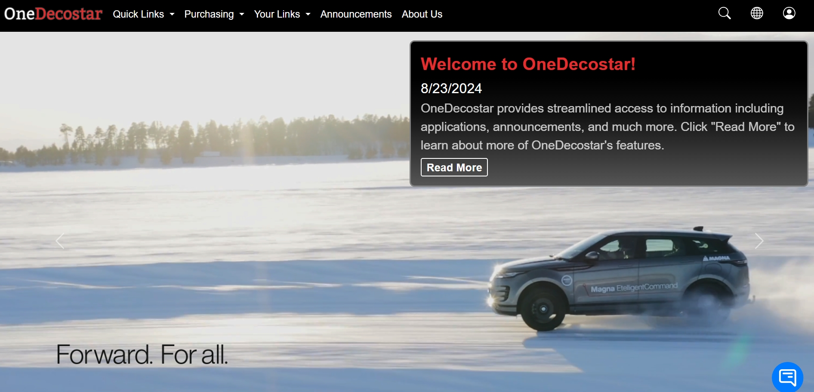

# OneDecostar

## 🚀 Introduction

This project was an intranet system built to enhance communication among various departments in a large organization. The system allowed users to upload important files, links, and resources, with varying levels of access control, improving cross-departmental collaboration and efficiency. Users could share resources with the entire organization or restrict access to specific individuals or departments.

## 🧰 Key Features
- **File and Link Sharing**: Users can upload important files and links to be shared across departments.
- **Access Control**: Department managers can grant access to specific individuals or departments.
- **Departmental and Personal Folders**: Resources could be shared with the entire company, only with the uploader, or with specific departments.
- **Announcements System**: Authorized individuals could issue announcements visible to specific groups or departments.
- **AI Chatbot Assistant**: A custom AI chatbot, built using the Azure OpenAI API, helped guide users around the site, answered basic usage questions, and answered common IT support questions.
- **Organizational Hierarchy Page**: A dedicated page displayed both department and leadership hierarchies to clarify reporting lines.
- **Search Functionality**: A basic search feature was included, alongside an advanced search that allowed users to search the entire organization's SharePoint for information.
- **Automatic Authentication**: Used Active Directory to restrict access to authorized company users only.
- **Local Server Hosting**: Hosted securely on the company’s internal server.

## 🛠️ Technologies Used

* **Backend**: C#, ASP.NET Core, SQL Server
* **Frontend**: HTML, CSS, JavaScript (including jQuery)
* **Authentication**: Windows Active Directory (for automatic authentication)

## ⚙️ How It Works

The system’s backend, built with C# and SQL Server, handled user authentication, access control, and file management. Using Active Directory, the system automatically authenticated users based on their company credentials, ensuring that only authorized personnel could access the system. Users, granted access by department managers, could upload links and files for general use or restrict them to certain individuals or departments. The frontend, built with HTML, CSS, and JavaScript, provided an intuitive interface for uploading and viewing content. The system was hosted on the company's local server, ensuring secure access within the internal network.

## 🖼️ Screenshot of the Homepage

## 👨‍💻 My Role as an Intern

As an intern, I primarily focused on the backend development of the system. I worked on setting up the database schema, implementing access control logic, and integrating the backend with the frontend. Additionally, I assisted with some frontend tasks, including UI improvements. I also had the opportunity to lead another intern and guide them through the development process.

## 🏁 Conclusion

This project was an excellent learning experience where I had the chance to learn new skills in C# and SQL Server while also gaining experience in frontend development. Leading another intern helped me improve my leadership and mentoring abilities. The system successfully improved communication between departments and streamlined the sharing of essential resources, while also ensuring secure access through Active Directory integration.